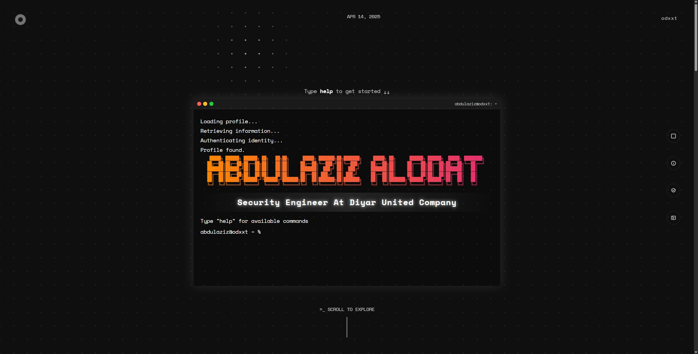

# Abdulaziz AlOdat - Interactive Portfolio Website

[](https://opensource.org/licenses/MIT)

A unique, interactive portfolio website designed to showcase projects and skills through a simulated terminal interface and engaging visual elements. Built with HTML, CSS, and vanilla JavaScript.



---

## ✨ Live Demo

Check out the live version here: **[alodat.me](https://alodat.me/)** 

---

## 🚀 About This Project

This portfolio is more than just a static page; it's an interactive experience designed to reflect my passion for cybersecurity, computer engineering, and creative development. The core concept revolves around a functional web-based terminal where visitors can interact with the site using familiar commands. It also incorporates various JavaScript-driven features and animations for a dynamic feel.

The goal was to create a memorable portfolio that not only displays my work but also demonstrates my technical skills in frontend development and creative problem-solving.

---

## ✨ Key Features

*   **Interactive Terminal Interface:**
    *   Simulated macOS-style terminal.
    *   Commands like `help`, `whoami`, `about`, `tools`, `projects`, `clear`, `exit`, etc.
    *   Fun commands: `snake`, `ascii`, `hack`, `destruct`, `odxxt`.
    *   Command history (Up/Down arrows) and Tab auto-completion.
    *   Idle message and reset functionality.
*   **Interactive Eye/Corner Element:** An animated corner element that automatically transforms into an interactive eye after a delay, tracks the mouse, blinks, and idles. Clickable to toggle states.
*   **Dynamic Toolkit Section:** Filterable grid showcasing skills across Software, Hardware, Design, and Security, complete with icons.
*   **Project Carousel:** Smooth, interactive carousel (mouse drag, touch swipe, button navigation) for showcasing projects and experiences.
*   **Responsive Design:** Adapts layout for various screen sizes (desktop, tablet, mobile).
*   **Subtle Animations:** Grid point interaction, scroll indicator, section reveal animations, animated headings, hover effects.
*   **Customizable ASCII Art:** Integrated generator within the terminal (`ascii` command).
*   **Education Tooltips:** Rich content tooltips appearing next to the education section on hover.

---

## 🛠️ Technologies Used

*   **Frontend:** HTML5, CSS3, Vanilla JavaScript (ES6+)
*   **Layout:** Flexbox, CSS Grid
*   **Fonts:** Google Fonts ('Space Mono')
*   **Icons:** SVG (Self-hosted)
*   **Features:**
    *   DOM Manipulation
    *   Event Listeners (click, keydown, mousemove, scroll, resize)
    *   CSS Variables (for theming)
    *   CSS Animations & Transitions (`@keyframes`)
    *   `localStorage` (for theme preference)
    *   `setTimeout`, `setInterval`, `requestAnimationFrame`
    *   `IntersectionObserver` (for section animations/navigation)
    *   `MutationObserver` (for reacting to theme changes in grid.js)

---

## ⚙️ Setup and Installation

This project is a static website and doesn't require a complex build process.

1.  **Clone the repository:**
    ```bash
    git clone https://github.com/odxxt/security-website
    ```
2.  **Navigate to the directory:**
    ```bash
    cd security-website
    ```
3.  **Open `index.html`:** Simply open the `index.html` file directly in your web browser.

No dependencies or build steps are required for the core functionality.

---

## 🕹️ Usage Guide

*   **Navigation:**
    *   Scroll down to explore sections.
    *   Use the navigation buttons on the right (desktop view) to jump to sections.
    *   Click the "Scroll to Explore" text or the Go-To-Top button.
    *   Use terminal commands (`about`, `tools`, `projects`).
*   **Terminal:**
    *   Click the terminal or type `help` to get started.
    *   Explore available commands (see `help -a` for a full list).
    *   Use ↑/↓ arrow keys for command history.
    *   Use Tab for auto-completion attempts.
*   **Toolkit Filters:** Click the category circles (S, D, H, C) to filter the displayed tools. Click an active filter again to show all tools.
*   **Project Carousel:** Click and drag, use arrow buttons, or swipe (on touch devices) to navigate projects.
*   **Corner Eye:** Wait 15 seconds for the eye to appear automatically. Click it to toggle back to the angle design. The eye tracks the mouse when active.

---

## 📄 License

Distributed under the MIT License. See `LICENSE` file (if you have one) or the link below for more information.

[https://opensource.org/licenses/MIT](https://opensource.org/licenses/MIT)

---

## 📧 Contact

Abdulaziz AlOdat - https://www.linkedin.com/in/alodat/ 
